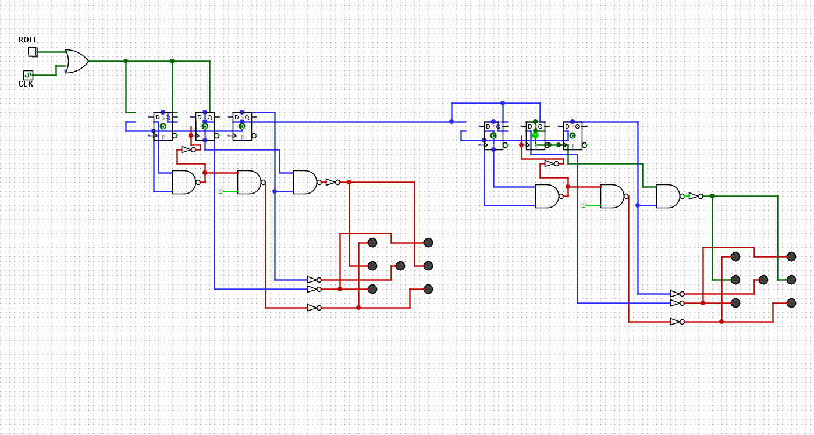
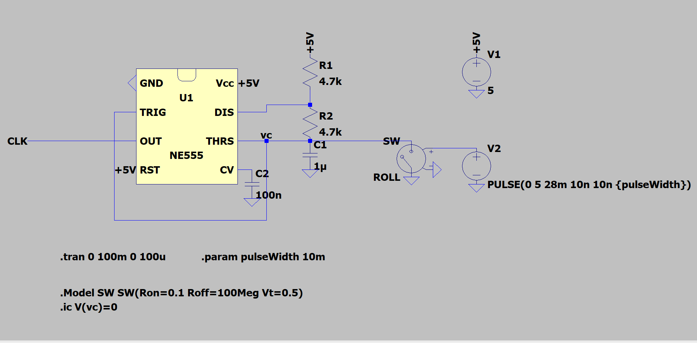

# Digital dice project.

You roll by keeping the button pressed.

The project is made using a 555 IC to generate the clock signal and a LFSR for the combinational logic made with ICs from the 74xx series.

The simulation of the clock circuitry is made in LtSpice and the simulation of the dices in logisim.

## Logisim circuit

*I loaded the circuit in logisim evo to screenshot it, I did not have the patience to reroute*
## LTSpice 555 circuit

